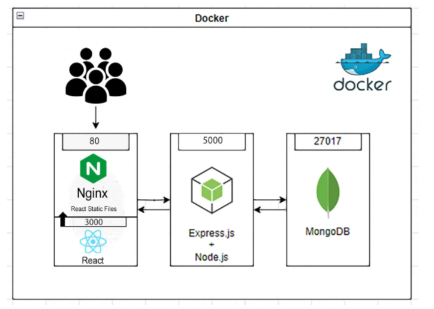

# Fi Money - Inventory Management System

A fully containerized full-stack inventory management application with JWT authentication, built with Node.js, Express, MongoDB, React, and Tailwind CSS. Deploy with Docker Compose in minutes!


## 🚀 Features

### Backend
- **Authentication System**
  - User registration and login
  - JWT-based authentication
  - Protected routes with middleware
  
- **Product Management**
  - Add new products with name, price, and other details
  - Update product quantities
  - Paginated product listing with search functionality
  - MongoDB integration with Mongoose

- **API Documentation**
  - Complete OpenAPI 3.0 documentation
  - Interactive Swagger UI at `/api-docs`
  - Request/response schemas and examples

- **Validation & Security**
  - Input validation using express-validator
  - Password hashing with bcrypt
  - CORS support
  - Environment variable configuration

### Frontend
- **Modern React Application**
  - Built with Vite for fast development and builds
  - Responsive design with Tailwind CSS
  - Context-based state management

- **User Interface**
  - Clean, professional dashboard with statistics
  - Intuitive authentication forms
  - Mobile-responsive navigation

- **User Experience**
  - Protected routes with authentication
  - Loading states and error handling

### Deployment
- **Docker Containerization**
  - Multi-stage Docker builds for optimized images
  - Docker Compose for orchestrating all services
  - Production-ready Nginx serving for frontend
  - Isolated database with persistent volumes

### 🚧 Future Enhancements
- Advanced analytics and reporting
- Product categories and filtering
- Image upload functionality
- Inventory alerts for low stock
- User roles and permissions
- Load balancing and scaling
- CI/CD pipeline integration

## 🛠️ Tech Stack

### Backend
- **Runtime**: Node.js
- **Framework**: Express.js
- **Database**: MongoDB with Mongoose ODM
- **Authentication**: JWT (JSON Web Tokens)
- **Validation**: express-validator
- **Documentation**: Swagger UI + OpenAPI 3.0
- **Security**: bcrypt for password hashing

### Frontend
- **Framework**: React 19 with Vite
- **Styling**: Tailwind CSS v4
- **Routing**: React Router DOM
- **HTTP Client**: Axios with interceptors
- **Icons**: Heroicons
- **State Management**: React Context API

### DevOps & Deployment
- **Containerization**: Docker & Docker Compose
- **Web Server**: Nginx (production)
- **Database**: MongoDB with persistent volumes
- **Environment**: Multi-stage builds for optimization

## 📋 Prerequisites

- Docker and Docker Compose
- Git (for cloning the repository)

**Or for local development:**
- Node.js (v18 or higher)
- MongoDB (local or cloud instance)
- npm or yarn package manager

## 🚀 Getting Started

### 🐳 Docker Deployment (Recommended)

**Quick Start - Run the entire application with one command:**

1. **Clone the repository**
   ```bash
   git clone https://github.com/opabhijeet/Fi_Money.git
   cd Fi_Money
   ```

2. **Create environment file**
   ```bash
   cp .env.example .env
   # Edit .env with your preferred values
   ```

3. **Start all services**
   ```bash
   docker-compose up -d
   ```

4. **Access the application**
   - **Frontend**: http://localhost (port 80)
   - **Backend API**: http://localhost:8080/api
   - **API Documentation**: http://localhost:8080/api-docs
   - **MongoDB**: localhost:27017

5. **Stop the application**
   ```bash
   docker-compose down
   ```

### 🔧 Local Development Setup

### Backend Setup

1. **Clone the repository**
   ```bash
   git clone https://github.com/opabhijeet/Fi_Money.git
   cd Fi_Money/Backend
   ```

2. **Install dependencies**
   ```bash
   npm install
   ```

3. **Environment Configuration**
   Create a `.env` file in the Backend directory:
   ```env
   MONGO_URL=mongodb://localhost:27017/inventory
   JWT_SECRET=your_jwt_secret_key
   PORT=8080
   ```

4. **Start the server**
   ```bash
   # Development mode with nodemon
   npm run dev
   
   # Production mode
   npm start
   ```

5. **Access the application**
   - API Base URL: `http://localhost:8080/api`
   - API Documentation: `http://localhost:8080/api-docs`

### Frontend Setup

1. **Navigate to the Frontend directory**
   ```bash
   cd ../Frontend
   ```

2. **Install dependencies**
   ```bash
   npm install
   ```

3. **Start the development server**
   ```bash
   npm run dev
   ```

4. **Access the application**
   - Frontend URL: `http://localhost:3000`
   - The frontend will proxy API requests to the backend server

### 🔄 Local Development - Running Both Servers

For local development, you need to run both servers:

1. **Terminal 1 - Backend**:
   ```bash
   cd Backend
   npm run dev
   ```

2. **Terminal 2 - Frontend**:
   ```bash
   cd Frontend  
   npm run dev
   ```

Then visit `http://localhost:3000` to use the full application.

## 🐳 Docker Information

### Services
- **Frontend**: React app served by Nginx on port 80
- **Backend**: Express.js API on port 8080  
- **Database**: MongoDB on port 27017

### Docker Commands
```bash
# Build and start all services
docker-compose up -d

# View logs
docker-compose logs -f

# Stop all services
docker-compose down

# Rebuild images
docker-compose build --no-cache

# Remove volumes (WARNING: deletes database data)
docker-compose down -v
```

## 📚 API Endpoints

### Authentication
- `POST /api/register` - Register a new user
- `POST /api/login` - User login

### Products (Protected Routes)
- `POST /api/products` - Add a new product
- `GET /api/products` - Get paginated product list
- `PUT /api/products/:id/quantity` - Update product quantity

### Documentation
- `GET /api-docs` - Interactive API documentation

## 🔒 Authentication

The API uses JWT (JSON Web Tokens) for authentication. After successful login, include the token in the Authorization header:

```
Authorization: Bearer <your_jwt_token>
```

## 📊 Database Schema

### User Model
```javascript
{
  username: String (required, unique),
  password: String (required, hashed),
  createdAt: Date
  updatedAt: Date
}
```

### Product Model
```javascript
{
  name: String (required),
  type: String,
  sku: String,
  imageUrl: String,
  description: String,
  quantity: Number (default: 0),
  price: Number (required),
  createdAt: Date,
  updatedAt: Date
}
```

## 🧪 Testing

### API Testing
You can test the API using:
- **Swagger UI**: Visit `http://localhost:8080/api-docs` for interactive testing
- **Postman**: Import the OpenAPI spec from `/api-docs-json` or use existing postman collection `InventoryAPI.postman_collection.json` 
- **Python Script**: Use the included `test_api.py` script

## 📁 Project Structure

```
Fi_Money/
├── docker-compose.yml       # Docker Compose configuration
├── .env                     # Environment variables
├── Backend/                 # Express.js API Server
│   ├── Dockerfile          # Backend container configuration
│   ├── controllers/         # Route handlers
│   │   ├── auth/
│   │   │   ├── login.js
│   │   │   └── register.js
│   │   ├── product/
│   │   │   ├── add_product.js
│   │   │   ├── get_products.js
│   │   │   └── update_product.js
│   │   └── analytics/
│   │       └── get_analytics.js
│   ├── lib/
│   │   └── auth.js          # Authentication middleware
│   ├── models/              # Mongoose models
│   │   ├── Product.js
│   │   └── User.js
│   ├── routes.js            # API routes definition
│   ├── server.js            # Express server setup
│   ├── swagger.js           # Swagger configuration
│   ├── package.json
│   └── test_api.py          # API testing script
├── Frontend/                # React Application
│   ├── Dockerfile          # Frontend container configuration
│   ├── public/
│   ├── src/
│   │   ├── components/      # Reusable React components
│   │   │   ├── Layout.jsx
│   │   │   ├── ThemeToggle.jsx
│   │   │   └── ProtectedRoute.jsx
│   │   ├── contexts/        # React Context providers
│   │   │   ├── AuthContext.jsx
│   │   │   └── ThemeContext.jsx
│   │   ├── pages/           # Page components
│   │   │   ├── Login.jsx
│   │   │   ├── Register.jsx
│   │   │   ├── Dashboard.jsx
│   │   │   ├── Products.jsx
│   │   │   └── Analytics.jsx
│   │   ├── services/        # API service layer
│   │   │   └── api.js
│   │   ├── App.jsx          # Main App component
│   │   ├── main.jsx         # React entry point
│   │   └── index.css        # Tailwind CSS imports
│   ├── package.json
│   ├── vite.config.js       # Vite configuration
│   └── tailwind.config.js   # Tailwind CSS configuration
└── README.md
```

## 🤝 Contributing

1. Fork the repository
2. Create your feature branch (`git checkout -b feature/AmazingFeature`)
3. Commit your changes (`git commit -m 'Add some AmazingFeature'`)
4. Push to the branch (`git push origin feature/AmazingFeature`)
5. Open a Pull Request

## 📝 License

This project is licensed under the MIT License - see the [LICENSE](LICENSE) file for details.

## 👨‍💻 Author

**Abhijeet Awasthi**
- GitHub: [@opabhijeet](https://github.com/opabhijeet)

## 🙏 Acknowledgments

- Express.js for the robust web framework
- React and Vite for the modern frontend development experience
- Tailwind CSS for rapid and responsive UI development
- MongoDB for flexible document storage
- Swagger for excellent API documentation
- JWT for secure authentication
- Docker for seamless containerization and deployment
- Nginx for efficient static file serving